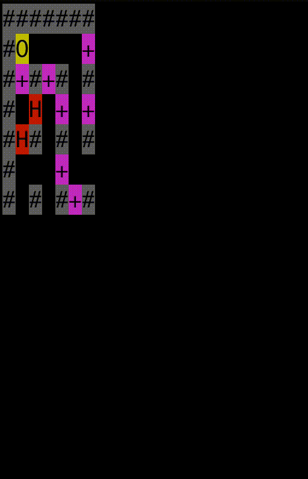
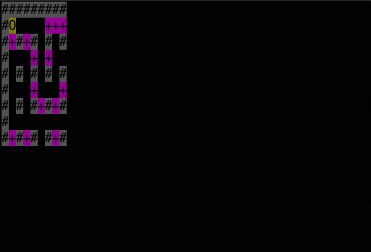

Contents
===
- [Usage](#usage)
- [Current state](#current-state)
- [How it's Done?](#how-its-done)
  - [Parsing](#parsing)
  - [Rendering](#rendering)
  - [Threads](#threads)
  - [Server](#server)
  - [Testing](#testing)
<hr>


## Usage
Open terminal in project's directory & write
`stack run bomberman-server`
to run bomberman's server, then open another terminal & write
`stack run`
to run the client.

OR

`stack test`
to run tests.
<hr>

## Current state
##### version 4

- Received JSON data is parsed using our own  `/src/Parser4.hs` functions.
- Colored rendering is done in `/src/MapRender.hs`.
- Testing is done in `/test/Spec.hs`.
- Server logic is in `/server/`
<!-- 
##### version 3

- Received JSON data is parsed using our own  `/src/Parser3.hs` functions.
- Colored rendering is done in `/src/MapRender.hs`.
- Testing is done in `/test/Spec.hs`.

##### version 2

- Received JSON data is parsed using our own  `/src/Parser2.hs` functions.
- Colored rendering is done in `/src/Lib2.hs`.
- Testing is done in `/src/Tests.hs`.

##### version 1
 
- Received JSON data is parsed using our own  `/src/Parser.hs` functions.
- Colored rendering is done in `/src/Lib1.hs`. -->
<hr>


## How it's Done?
### Parsing

##### Parsing JSON
1. We have constructed a type `Parser` using a monad transformer `ExceptT` and a state monad `State` from the package `transformers`.
In `State` we keep a tuple for the unparsed string and the number of parsed characters.
```haskell
type Parser a = ExceptT ParserError (State (String, Integer)) a
```

2. We later use the the number of parsed characters to print more concise error messages in data `ParserError`.
```haskell
instance Show ParserError where
  show (ParserError index message) = "Error after index " ++ show index ++ ": " ++ message
```

3. We determine the JSON value type and pass to an according parser.
```haskell
parseJsonLike :: Parser JsonLike
parseJsonLike = do
  (input, index) <- getState
  let x:xs = input
  if x == '\"'
    then parseJsonLikeString
  else if x == '{'
    then parseJsonLikeObject
  else if x == '[' 
    then parseJsonLikeList
  else if x == 'n'
    then parseJsonLikeNull
  else if isDigit x || x == '-'
    then parseJsonLikeInteger
  else throwE $ ParserError index "No json value could be matched"
```

4. Each JSON value gets parsed by it's own specific way of parsing and is then constructed in an ADT that directly reflects the JSON data types.
```haskell
data JsonLike
  = JsonLikeInteger Integer
  | JsonLikeString String
  | JsonLikeObject [(String, JsonLike)]
  | JsonLikeList [JsonLike]
  | JsonLikeNull
  deriving (Show)
```

##### Checking game logic
After parsing, the parsed json string is converted into a specific struture:
`[("bomb/bricks/anythingElse", [[x, y]])] [(String, [[Int]])]`

If one of the points is encountered, we notify about any errors:
    - if the amount of ints in array (coordinates) is not 2
    - if there are no "bomb" or "surroundings" keys
    - if it cointains wrong types, values etc.


1. We Extract values from values of "bomb" and "surrounding". We parse linked list into `[[Int]]`.
```haskell
jsonExtract [("bomb", js@(JsonLikeList [JsonLikeInteger x, JsonLikeInteger x']))] = do
    res <- getListElements [js] "bomb"
    return [("bomb", res)]
jsonExtract [(key, JsonLikeList xs)] = do
    res <- getListElements xs key
    return [(key, res)]
jsonExtract [(key, JsonLikeNull)] = Right [(key, [])]
jsonExtract [(key, JsonLikeObject xs)] = do
  coordinates <- constructList xs
  return [(key, coordinates)]
jsonExtract [(key, _)] = Left ("Error: \"" ++ key ++ "\" should have an object (a linked list) as a value, not a list, string or integer.")
jsonExtract (x:xs) = do
  pair <- jsonExtract [x]
  pairs <- jsonExtract xs
  return $ pair ++ pairs
```

2. We construct a list of coordinates.
```haskell
constructList :: [(String, JsonLike)] -> Either String [[Int]]
constructList [("head", JsonLikeNull) , ("tail", JsonLikeNull)] = Right []
constructList [("head", JsonLikeList jval), ("tail", JsonLikeObject obj)] = do
  listH <- constructListHead jval
  listT <- constructList obj
  return $ listH ++ listT
constructList _  = Left "Error: linked list should have \"head\" with a list (or null, if empty) as a value, and \"tail\" with an object (or null) as a value."
```

##### Constructing record MapElements from JsonLike ADT
We construct a record MapElements from the ADT JsonLike which lets us easily get the coordinates of a desired object:
```haskell
data MapElements = MapElements {
                bomb :: [[Int]],
                bombermans :: [[Int]],
                bricks :: [[Int]],
                gates :: [[Int]],
                ghosts :: [[Int]],
                wall :: [[Int]],
                bGhosts :: [[Int]],
                bBricks :: [[Int]]}
                deriving (Show, Read)
```

### Rendering
1. `init`, responsible for initializing the game, calls generateEmptyMap which populates an array with default symbols.
```haskell
generateEmptyMap :: InitData -> Map
generateEmptyMap (InitData w h) = [(entryNumber, defaultSym) | entryNumber <- [0 .. (w * h)]]
```

2. `getStaticEntries` and `getDynamicEntries` gets the static and dynamic entries from the `MapElements` ADT.
```haskell
getStaticEntries :: MapElements -> InitData -> [[Entry]]
getStaticEntries surr iData = map (getEntries' surr iData) staticMEfuns

getDynamicEntries :: MapElements -> InitData -> [[Entry]]
getDynamicEntries surr iData = map (getEntries' surr iData) dynamicMEfuns
``` 

3. `update` calls `updateMap` only if the newest JSON string is different from the last one. UpdateMap collects all entries from a `MapElements` object, puts them into the map and passes bombermans' coordiantes to the state, as they should not be in the map. The previous map is changed to a new map if a bomb is placed or explodes.
```haskell
updateMap :: State -> State
updateMap (State json iData prevMap _ lBomb _) =
  if isRight mapElements then
    let mapElements' = head (rights [mapElements])
        entries = concat (getStaticEntries mapElements' iData)
        dynamicElements = concat (getDynamicEntries mapElements' iData)
        newBombs = getBombs mapElements'

        mapAfterExplosion = explodeBombs prevMap iData lBomb newBombs

        newMap = addToMap entries mapAfterExplosion
    in State json iData newMap dynamicElements newBombs""
  else
    State json iData [] [] [] (head (lefts [mapElements]))
  where
      mapElements = createMapElements json
```

4. Finally, if `render` is called, it makes a copy of the map with bomberman inserted and joins every entry into a single `String`. It also shows `str`, which is useful for debugging.
```haskell
render (State json iData sMap dMap lBomb "") = mapToString
  where
    mapWithDynamicEls = addToMap dMap sMap
    w = gameWidth iData
    mapToString = concat [str ++ p | (i, str) <- mapWithDynamicEls,
                          let p = if (i + 1) `mod` w == 0 then newlineSym else ""]
render (State _ _ _ _ _ errorMessage) = errorMessage
```

### Threads

Threads are used to check if the bomb is exploded.
We have two threads.
The Main thread which is responsible for 'catching user's commands'
```haskell
launchThread :: State -> Sess.Session -> GameId -> IO ()
launchThread state sess uuid = do
  forkIO (bgUpdateMap state sess uuid)
  catchInput sess uuid
```
and the other which renders the game every `renderingInterval`, which is set to 100000 microseconds right now.


### Server
#### `/server/Main.hs`
Our server's API is written using **Scotty framework**. The endpoints,
to which our server reacts and calls specific functions, 
are defined in the `serverApplication` function:
```haskell
serverApplication :: STM.TVar Games -> STM.TVar [String] -> S.ScottyM ()
serverApplication gamesVar uuidsVar = do
  S.post (capture "/game/play/:uuid") $ do
    addJsonHeader
    uuidLazy <- getParameter "uuid"
    rawBody <- S.body
    let uuid = L.unpack uuidLazy
        req = C.unpack rawBody
    response <- liftIO $ playGame req uuid gamesVar

    case response of
      (E.Left e) -> S.raw $ cs $ show e
      (E.Right js) -> S.raw $ cs $ extract $ fromJsonLike js


  S.get (literal "/game/new/random") $ do
    addJsonHeader
    (str, gameData, uuid) <- liftIO createNewGameSession
    if uuid == "" then
      S.raw $ cs ("Couldn't create a game" :: String)
    else do
      liftIO $ insertGame uuid gameData gamesVar
      liftIO $ insertUUID uuid uuidsVar
      liftIO $ forkIO $ ghostThread uuid gamesVar
      S.raw $ cs str


  S.get (literal "/game/list") $ do
    addJsonHeader
    uuids <- liftIO $ STM.readTVarIO uuidsVar
    S.raw $ cs $ show uuids
```
If server receives and empty game UUID or UUID which doesn't exist, it
returns an error to the client, otherwise it applies the received user's commands to the game:
```haskell
playGame :: String -> String -> STM.TVar Games -> IO (Either String JsonLike)
playGame commandsString uuid gamesVar = do
  gameM <- STM.atomically $ do
    games  <- STM.readTVar gamesVar
    findGame uuid gamesVar
  
  (result, bombStatus) <- STM.atomically $ playGame' commandsString uuid gameM (\ gameVar game cs1 cs2 -> 
    case GameMap.status game of
      GameWon -> return (toJsonLike game, False)
      GameLost -> return (toJsonLike game, False)
      Playing -> do
        let (newGame, bombStatus) = applyGameCommands (game, False) cs1  -- First apply commands that plant bomb or move bomberman.
        STM.writeTVar gameVar newGame

        let shownGame = applyFetchCommands newGame cs2 -- Applying fetching commands and sending game data.
            jsonGameData = toJsonLike shownGame

        return (jsonGameData, bombStatus))

  if bombStatus then do
    forkIO $ bombThread uuid gamesVar
    return result
  else
    return result
```

#### `/server/GameMap.hs`
The functions in this file are responsible for applying user's commands to the current `GameData` map and returning an updated `GameData` map:
```haskell
applyCommand :: Command -> (GameData, Bool) -> (GameData, Bool)
applyCommand c (gd, b) = case c of
  MoveBomberman direction -> (moveBomberman direction gd, b)
  PlantBomb -> plantBomb gd
  FetchSurrounding -> (gd, b)
  FetchBombStatus  -> (gd, b)
  FetchBombSurrounding  -> (gd, b)

-- | Use this function for fetch commands.
applyFetchCommands :: GameData -> [Command] -> GameData
applyFetchCommands gd cms
  | a && b && c = (getSurrounding gd) {bomb = bomb gd }
  | a && b = (getSurrounding gd) {bomb = bomb gd }
  | a && c = gameDataEmpty {bomb = bomb gd }
  | b && c = (getSurrounding gd) {bomb = []}
  | otherwise = gd
  where a = FetchSurrounding `elem` cms
        b = FetchBombStatus `elem` cms
        c = FetchBombSurrounding `elem` cms

moveBomberman :: Direction -> GameData -> GameData
moveBomberman direction gd = case direction of
  Lib3.Up -> checkGameStatus $ moveBomberman' (x - 1, y) gd
  Lib3.Down -> checkGameStatus $ moveBomberman' (x + 1, y) gd
  Lib3.Left -> checkGameStatus $ moveBomberman' (x, y - 1) gd
  Lib3.Right -> checkGameStatus $ moveBomberman' (x, y + 1) gd
  where
    [(x, y)] = bombermans gd
```
It also converts a predefined stringified map into `GameData` map when user starts new game and then returns it:
```haskell
getGameMapData :: GameMap -> GameData
getGameMapData x = constructGameData gd gameMapElements
  where
    gameMapElements = getGameMapData' x
    gd = gameDataEmpty {mapSize = getGameMapSize x}


getGameMapSize :: GameMap -> (Int, Int)
getGameMapSize x = (getGameMapWidth x, getGameMapHeight x)

gameMapCollection :: [GameMap]
gameMapCollection = filter isCorrectMap' gameMapCollection'

-- Make sure to check if your map is corret with function isCorrectMap before adding it to the collection,
-- otherwise it won't be inluded when server is launched.
gameMapCollection' :: [GameMap]
gameMapCollection' = [gameMap1, gameMap2, gameMap3]


isCorrectMap :: GameMap -> Either String Bool
isCorrectMap (GameMap gm)
  | not lengthCheck = E.Left "Error: Map length is not the same in all lines."
  | bm /= 1 = E.Left "Error: There must be one and only one bomberman in the map."
  | ga < 1 = E.Left "Error: There must be at least one gate in the map."
  | otherwise = E.Right True
  where lengthCheck = isCorrectLength gm
        (bm, ga) = countGatesAndBombermans (concat gm) (0, 0)

gameMap1 :: GameMap
gameMap1 = GameMap [
        "XXXXXXXXXXXXXXX",
        "XM    BBBBBBBBX",
        "XBXBX X X X X X",
        "X G B B   B   X",
        "X X X X X XBXBX",
        "X G B   B     X",
        "X X XBXBX XBXBX",
        "X G  G    B B X",
        "XBXBX XBXBXBXBX",
        "X     BG      X",
        "XBXBX XBXBXBX X",
        "X     B       X",
        "X XBXBXBXBXBXBX",
        "X  BG      B OX",
        "XXXXXXXXXXXXXXX"]
```

### Testing


Our parser is tested with various json strings by using the HUnit framework.
One part of the tests are dedicated to checking the parser. Acceptance tests (`acceptanceJsonTests`) test whether the given value of `runParser` is Right and rejection tests (`rejectionJsonTests`) test if the given value of `runParser` is Left.
The other part of the tests (`gameTests`) are meant to test the parser determining whether the json suits the game logic. Accordingly checking if `runGameParser` throws error if not suitable string is passed, and does not throw error otherwise.


