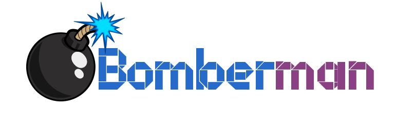
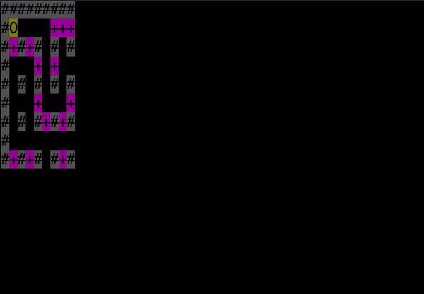
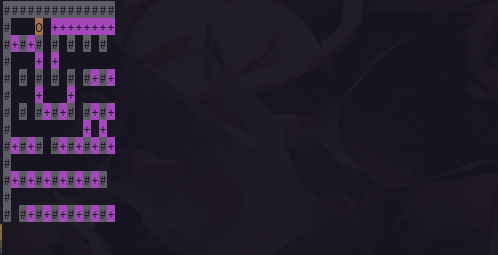
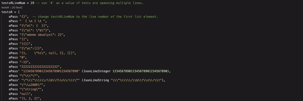

Contents
===
- [Usage](#usage)
- [Current state](#current-state)
- [How it's Done?](#how-its-done)
  - [Parsing](#parsing)
  - [Rendering](#rendering)
  - [Testing](#testing)
<hr>


## Usage
Open terminal in project's directory & write
`stack run bomberman-client-1`
to play the first version,
`stack run bomberman-client-2`
to play the second version.
<hr>

## Current state
##### version 2

- Received JSON data is parsed using our own  `/src/Parser2.hs` functions.
- Colored rendering is done in `/src/Lib2.hs`.
- Testing is done in `/src/Tests.hs`.

##### version 1
 
- Received JSON data is parsed using our own  `/src/Parser.hs` functions.
- Colored rendering is done in `/src/Lib1.hs`.
<hr>


## How it's Done?
### Parsing

##### Parsing JSON
1. First, we create an ADT JsonLike that directly reflects the JSON data types.
```haskell
data JsonLike
  = JsonLikeInteger Integer
  | JsonLikeString String
  | JsonLikeObject [(String, JsonLike)]
  | JsonLikeList [JsonLike]
  | JsonLikeNull
  deriving (Show)
```

2. We determine the JsonLike value type and pass to an according parser.
```haskell
parseJsonLike :: (String, Integer) -> Either String (JsonLike, (String, Integer))
parseJsonLike ([], index) = Left $ "Error after index " ++ show index ++ ": Unexpected end of string"
parseJsonLike (x:xs, index)
  | x == '\"' = parseJsonLikeString (x:xs, index)
  | x == '{' = parseJsonLikeObject (x:xs, index)
  | x == '[' = parseJsonLikeList (x:xs, index)
  | x == 'n' = parseJsonLikeNull (x:xs, index)
  | isDigit x || x == '-' = parseJsonLikeInteger (x:xs, index)
  | otherwise = Left $ "Error after index " ++ show index ++ ": No json value could be matched"
```

3. Before parsing any JsonLike value, we drop the beggining of the string while it's a whitespace character.
```haskell
stripStart :: (String, Integer) -> (String, Integer)
stripStart ([], index) = ([], index)
stripStart ([x], index)
  | isSpace x = stripStart ([], index + 1)
  | otherwise = ([x], index)
stripStart (x:xs, index)
  | isSpace x = stripStart (xs, index + 1)
  | otherwise = (x:xs, index)
```

4. Each JsonLike value type gets parsed by it's own specific way of parsing.

##### Checking game logic
After parsing, the parsed json string is converted into a specific struture:
`[("bomb/bricks/anythingElse", [[x, y]])] [(String, [[Int]])]`

If one of the points is encountered, we notify about any errors:
    - if the amount of ints in array (coordinates) is not 2
    - if there are no "bomb" or "surroundings" keys
    - if it cointains wrong types, values etc.


1. We Extract values from values of "bomb" and "surrounding". We parse linked list into `[[Int]]`.
```haskell
jsonExtract :: [(String, JsonLike)] -> Either String [(String, [[Int]])]
jsonExtract [(key, JsonLikeNull)] = Right [(key, [])]
jsonExtract [(key, JsonLikeObject xs)]
  | isLeft coordinates = Left $ head (lefts [coordinates])
  | otherwise = Right [(key, concat coordinates)]
  where coordinates = constructList xs
```

2. We construct a list of coordinates.
```haskell
constructList :: [(String, JsonLike)] -> Either String [[Int]]
constructList [("head", JsonLikeNull) , ("tail", JsonLikeNull)] = Right []
constructList [("head", JsonLikeList jval), ("tail", JsonLikeObject obj)]
  | hasLeft = Left (intercalate "\n" (lefts [listH, listT]))
  | otherwise = Right (concat (rights [listH, listT]))
  where listH = constructListHead jval
        listT = constructList obj
        hasLeft = isLeft listH || isLeft listT
constructList _  = Left "Error: linked list should have \"head\" with a list (or null, if empty) as a value, and \"tail\" with an object (or null) as a value."
```

##### Constructing record MapElements from JsonLike ADT
We construct a record MapElements from the ADT JsonLike which lets us easily get the coordinates of a desired object:
```haskell
data MapElements = MapElements {
                bomb :: [[Int]],
                bombermans :: [[Int]],
                bricks :: [[Int]],
                gates :: [[Int]],
                ghosts :: [[Int]],
                wall :: [[Int]]}
                deriving (Show, Read)
```

### Rendering
1. `init`, responsible for initializing the game, calls generateEmptyMap which populates an array with default symbols.
```haskell
generateEmptyMap :: InitData -> [(Int, String)]
generateEmptyMap (InitData w h) = [(entryNumber, defaultSym) | entryNumber <- [0 .. (w * h)]]
```

2. `getStaticEntries` and `getDynamicEntries` gets the static and dynamic entries from the `MapElements` ADT.
```haskell
getStaticEntries :: MapElements -> InitData -> [[Entry]]
getStaticEntries surr iData = map (getEntries' surr iData) staticMEfuns

getDynamicEntries :: MapElements -> InitData -> [[Entry]]
getDynamicEntries surr iData = map (getEntries' surr iData) dynamicMEfuns
``` 

3. `update` calls `updateMap` only if the newest JSON string is different from the last one. UpdateMap collects all entries from a `MapElements` object, puts them into the map and passes bombermans' coordiantes to the state, as they should not be in the map. The previous map is changed to a new map if a bomb is placed or explodes.
```haskell
updateMap :: State -> State
updateMap (State json iData prevMap _ lBomb _) =
  if isRight mapElements then
    let mapElements' = head (rights [mapElements])
        entries = concat (getStaticEntries mapElements' iData)
        dynamicElements = concat (getDynamicEntries mapElements' iData)
        newBombs = getBombs mapElements'

        mapAfterExplosion = explodeBombs prevMap iData lBomb newBombs

        newMap = addToMap entries mapAfterExplosion
    in State json iData newMap dynamicElements newBombs""
  else
    State json iData [] [] [] (head (lefts [mapElements])) 
  where
      mapElements = createMapElements json
```

4. Finally, if `render` is called, it makes a copy of the map with bomberman inserted and joins every entry into a single `String`. It also shows `str`, which is useful for debugging.
```haskell
render (State json iData sMap dMap lBomb "") = mapToString
  where
    mapWithDynamicEls = addToMap dMap sMap
    w = gameWidth iData
    mapToString = concat [str ++ p | (i, str) <- mapWithDynamicEls,
                          let p = if (i + 1) `mod` w == 0 then newlineSym else ""]
render (State _ _ _ _ _ errorMessage) = errorMessage
```

### Testing


Our parser is tested with variuos json strings.
One part of the tests is dedicated to checking the parser, whether it succeeds with correct json grammar in `aPass` and whether it throws error messages with corrupted jsons in `aFail`.
The other part of the tests is meant to test the parser determining whether the json suits the game logic. Accordingly `gAPass` and `gAFail` tests are used for that.
